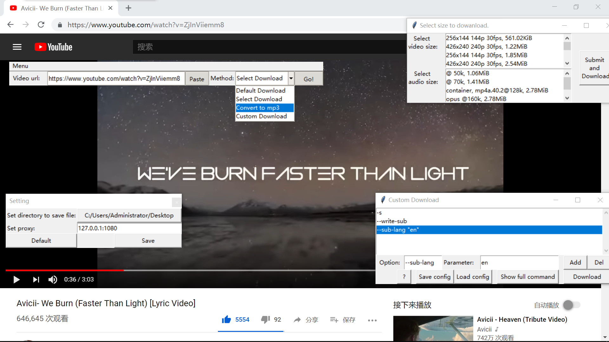

# youtube-dl-gui-downloader

A youtube-dl GUI tool build with tkinter, which is easy to use.

一个使用tkinter模块构建的，易用的轻量级youtube-dl图形化工具。



# Download

#### Sharing is not an excuse for piracy.

###### Windows:

Please turn to the [releases](https://github.com/SolomonLeon/youtube-dl-GUI-Downloader/releases).
If you didn't install youtube-dl into your computer yet, please turn to [youtube-dl](github.com/ytdl-org/youtube-dl/releases/latest) to download "youtube-dl.exe" and turn to [FFmpeg](https://ffmpeg.zeranoe.com/builds/) to download ffmpeg.

###### Mac OS and Linux desktop:

SORRY, I haven't build special version for you :-(

But you can download my Source code and build them! :-D See "Develop"

# Develop

You can download my code by

```shell
git clone git@github.com:SolomonLeon/youtube-dl-GUI-Downloader.git
```

or use "Download ZIP" button on the github page.

Before building your code, you only need to install "pyperclip".

```shell
pip install pyperclip
```

If you have any idea, please send me by pull request, or issues. Enjoy your coding trip!

# Notes
If you failed with error "10061" or "10060", please edit the "proxy setting" in "Menu".
You can use command "start inetcpl.cpl" (windows) to view your system proxy setting.

I currently do not provide any proxy services.
